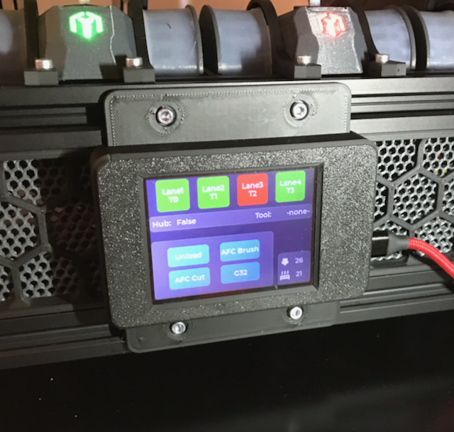
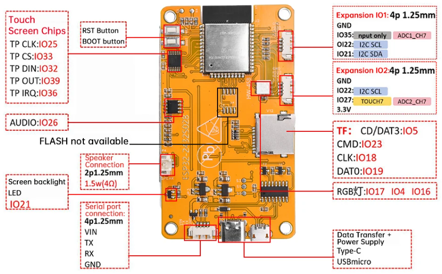

# TurtleScreen Interface for BoxTurtle AFC using CYD (cheap yellow display - see [github CYD](https://github.com/witnessmenow/ESP32-Cheap-Yellow-Display.git))

## infos
- based on the work of sbtoonz [github TurtleScreen](https://github.com/sbtoonz/TurtleScreen)
- modified for display SUNTON-ESP32-320-240 (ESP32-2432S028R known as CYD) - for docs see [github CYD](https://github.com/witnessmenow/ESP32-Cheap-Yellow-Display.git)
- case can be found in folder [case/STL](./case/STL/)
- power supply via USB-C or USB-Micro cable or via serial port connector (VIN/GND: 5V)

## case
 

## CYD pinout

